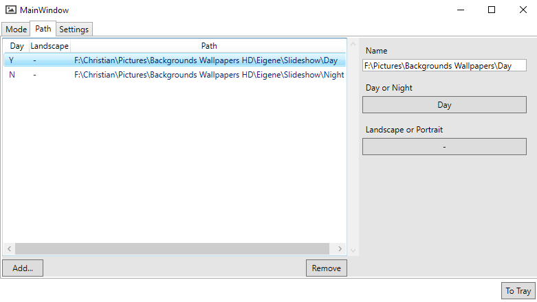

## BackgroundManager

This Application can change your desktop wallpaper like windows, but it features more detailed rules.

Images can be changed after the following rules:

*  Screen Orientation
*  Interval
*  Day / Night

So one path (or image) can be assigned to following attributes:

```
1. Day only / Night only / Both (Don't care)
2. Landscape only / Portrait only / Both (Don't care)
```

---

You can add multiple paths/files and combine all of the rules as you want.

When one of the condition changes (screen rotates, the sun sets, the interval time is up),
a new image will be set from all of the images matching the condition.

---

### Example

Imagine your timer is set to 30 minutes and your pathes are set as follows.


###### Note
  The shown attributes are ignored, if the option is not set in the `Mode` tab




After 30 minutes, the programm will check the current conditions. 

As the ```Landscape``` property is set to ```Don't care``` both paths are a valid option, disregarding your screen orientation.

Depending on the daytime, the programm will now choose the first or the second option.

In the next step, it'll randomly choose one image of the directory and set it as new background. 


You can now add multiple paths or a path to a single file and the programm will choose from all of the matching files.


